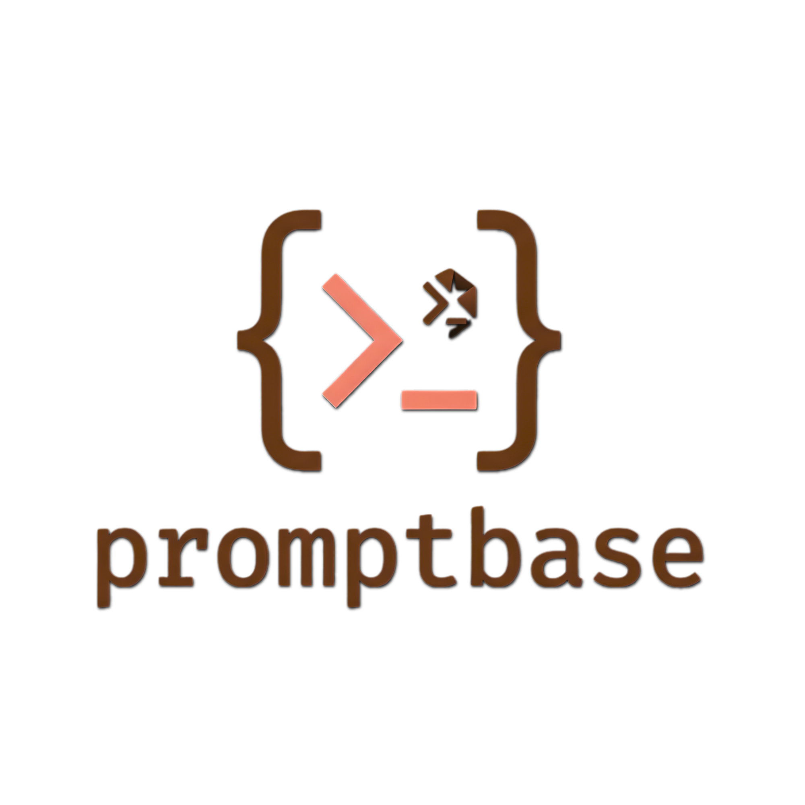

<div align="center">
  
  <h1>PROMPTBASE</h1>
</div>


> **The community-driven LLM prompt library for builders.**

Promptbase is a production-grade collection of technical prompts optimized for real-world engineering workflows. From agentic logic and DAW automation to WSL2 networking and AI safety guardrails, we curate prompts that work where it matters.

**🌐 Explore the library:** [https://julesklord.github.io/promptbase/](https://julesklord.github.io/promptbase/)

## 🚀 Quick Start

1. **Clone & Install**
   ```bash
   git clone https://github.com/julesklord/promptbase.git
   cd promptbase
   npm install
   ```
2. **Launch Dev Server**
   ```bash
   npm start
   ```
3. **Explore**
   Navigate to `http://localhost:5500` to browse the library.

## 📚 Technical Documentation

We maintain a distributed documentation suite following the `/make-doc` standard for maximum clarity and maintainability.

| Document                                                           | Description                                                      |
| ------------------------------------------------------------------ | ---------------------------------------------------------------- |
| [🏗️ Architecture](/g:/DEVELOPMENT/promptbase/docs/ARCHITECTURE.md) | Technical deep-dive into the modular ESM and event-driven state. |
| [📋 API & Schema](/g:/DEVELOPMENT/promptbase/docs/API_SCHEMA.md)   | Definition of `prompts.json` and internal module interfaces.     |
| [🧪 Testing](/g:/DEVELOPMENT/promptbase/docs/TESTING.md)           | E2E validation strategy using Playwright.                        |
| [⚖️ Governance](/g:/DEVELOPMENT/promptbase/docs/GOVERNANCE.md)     | Approval authority and contribution policies.                    |
| [🤝 Contributing](/g:/DEVELOPMENT/promptbase/CONTRIBUTING.md)      | How to submit your own prompts to the community.                 |

## 🛠️ Technology Stack

- **Frontend**: Vanilla HTML/JS (ES6+ Modules).
- **Styling**: Zero-framework CSS (Custom Properties, Flexbox, Grid).
- **Data**: Static JSON persistence.
- **Testing**: Playwright.
- **DevOps**: GitHub Pages (hosting) + browser-sync.

## ⚖️ License

Promptbase is Open Source and licensed under the [MIT License](LICENSE).

---

Built with 🔴 by **Jules Martins** and the dev community.
