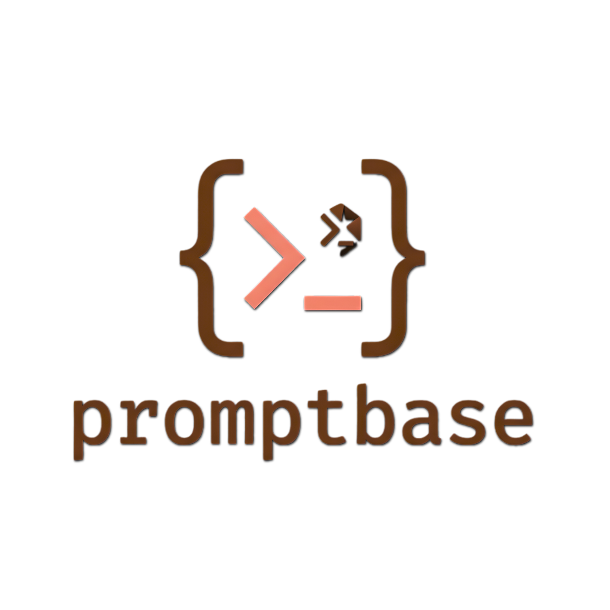

<table border="0">
  <tr>
    <td width="200" align="center" valign="top">
      
    </td>
    <td valign="top">
      <h1>Promptbase</h1>
      <p><strong>The community-driven LLM prompt library for builders.</strong><br/>
      <em>Production-grade technical prompts optimized for real-world engineering workflows.</em></p>
      <p>
        <a href="LICENSE"></a>
        
        
      </p>
    </td>
  </tr>
</table>

---

**🌐 Explore the library:** [https://julesklord.github.io/promptbase/](https://julesklord.github.io/promptbase/)

## 🚀 Quick Start

1. **Clone & Install**
   ```bash
   git clone https://github.com/julesklord/promptbase.git
   cd promptbase
   npm install
   ```
2. **Launch Dev Server**
   ```bash
   npm start
   ```
3. **Explore**
   Navigate to `http://localhost:5500` to browse the library.

## 📖 Documentation

For a comprehensive technical breakdown, architectural ADRs, and operational guides, visit our official **[Wiki](docs/wiki/index.md)**.

*   **[Technical Architecture](docs/wiki/ARCHITECTURE.md)**
*   **[API & Schema](docs/wiki/API_SCHEMA.md)**
*   **[Testing Strategy](docs/wiki/TESTING.md)**
*   **[Agent SOP](docs/AGENT.md)**

## 🛠️ Technology Stack

- **Frontend**: Vanilla HTML/JS (ES6+ Modules).
- **Styling**: Zero-framework CSS (Custom Properties, Flexbox, Grid).
- **Data**: Static JSON persistence.
- **Testing**: Playwright.
- **DevOps**: GitHub Pages (hosting) + browser-sync.

## ⚖️ License

Promptbase is Open Source and licensed under the [MIT License](LICENSE).

---

Built with 🔴 by **Jules Martins** and the dev community.
